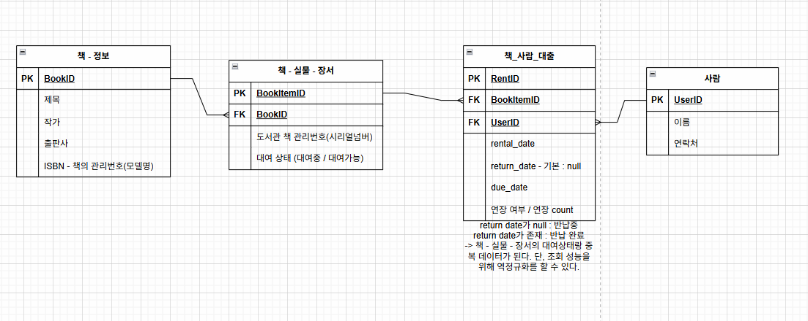

- 데이터가 왜 저장되나면
- 우리가 그 서비스를 사용하면서 자연스럽게
    그 서비스가 뭘 하는지를 상상하면 데이터가 나옵니다.

#### 도서관
- 책을 읽어요. -> 책이 있어야해요.
    도서관은 책을 관리한다.
- 책을 빌려요. -> 회원정보
    도서관에는 회원이 존재한다.
    - 반납
    - 연체
    - 예약
    - 분실
    - 낡아서 버려야됨
    ...

- 책
    제목
    지은이
    출판사
    페이지수
    카테고리
    재고수
    관리번호

실물 책 <-> 사람

이름            작가
해리포터 1권    j.k.롤링
해리포터 1권    j.k.롤링
"책 자체에대한 정보"가
중복되서 나타납니다.
책 / 실물 책(장서)을 분리합니다.

