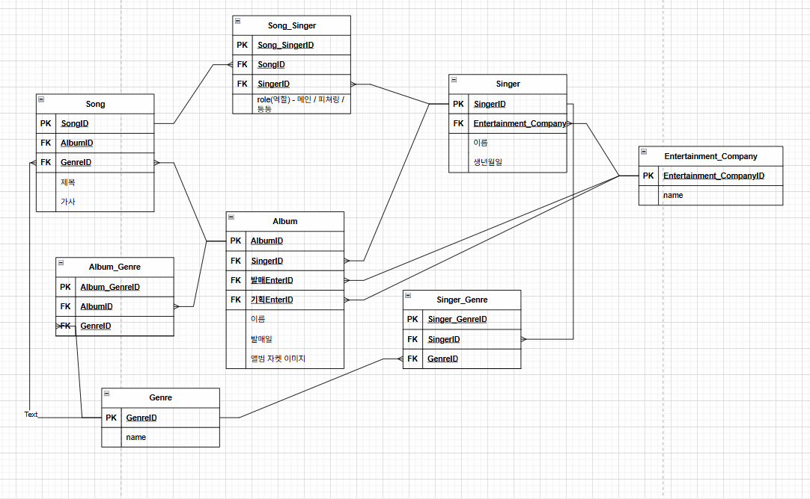

## 나의 기획
- 노래 - 앨범
	- 하나의 노래는 하나의 앨범에만 실린다.
	- 하나의 앨범에는 여러 노래가 실린다.
- 노래 - 가수
	- 하나의 노래는 한명의 가수만 부른다.
        -> 하나의 노래를 여러 명의 가수가 부른다.
            연관테이블이 생기면서 가수가 노래를 부를 때에 대한 추가적인 정보를 저장할 수 있다.
            ex) role(메인 / 피쳐링 / 참여 등등)
	- 한명의 가수는 여러 노래를 부른다.
- 가수 - 앨범
	- 한명의 가수는 여러 개의 앨범을 가진다.
	- 한개의 앨범은 한개의 가수가 보유한다.

### 추가할 내용들
- 장르 추가해보자
	노래는 하나의 장르
	앨범은 여러 장르
		노래를 통해서 join이 가능하지만
		역정규화를 함 (노래에 존재하는 장르를 추가하지 않을 수 있음)
- 소속사(엔터사)를 추가해보자
	엘범은 기획사 / 배포사 2개의 엔터사
	가수는 하나의 엔터사
