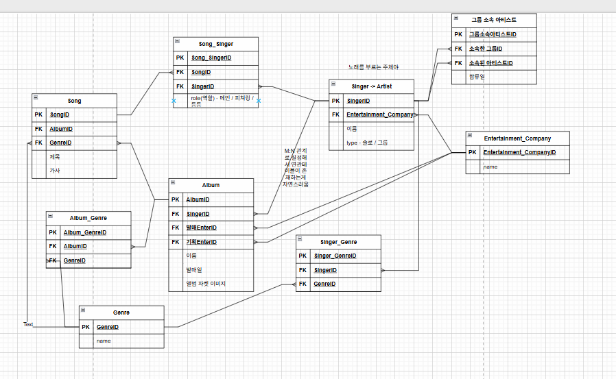

## 나의 기획
- 노래 - 앨범
	- 하나의 노래는 하나의 앨범에만 실린다.
	- 하나의 앨범에는 여러 노래가 실린다.
- 노래 - 가수
	- 하나의 노래는 한명의 가수만 부른다.
        -> 하나의 노래를 여러 명의 가수가 부른다.
            연관테이블이 생기면서 가수가 노래를 부를 때에 대한 추가적인 정보를 저장할 수 있다.
            ex) role(메인 / 피쳐링 / 참여 등등)
	- 한명의 가수는 여러 노래를 부른다.
- 가수 - 앨범
	- 한명의 가수는 여러 개의 앨범을 가진다.
	- 한개의 앨범은 한개의 가수가 보유한다.

### 추가할 내용들
- 그룹을 추가해보자
	사실 그룹과 가수는 역할이 같다 (노래를 부르고 / 앨범을 갖고)
	따라서 song 과 album과 연관을 지을 때 같은 방식으로 지어야할 것 같습니다.
	table을 분리하자니 둘중 하나는 반드시 null인 경우가 존재합니다. 차라리 합칩시다.
	singer + group -> artist
	대신 자기자신과의 관계를 통해 그룹 - 소속인원의 관계를 연관테이블로 만들었습니다.

