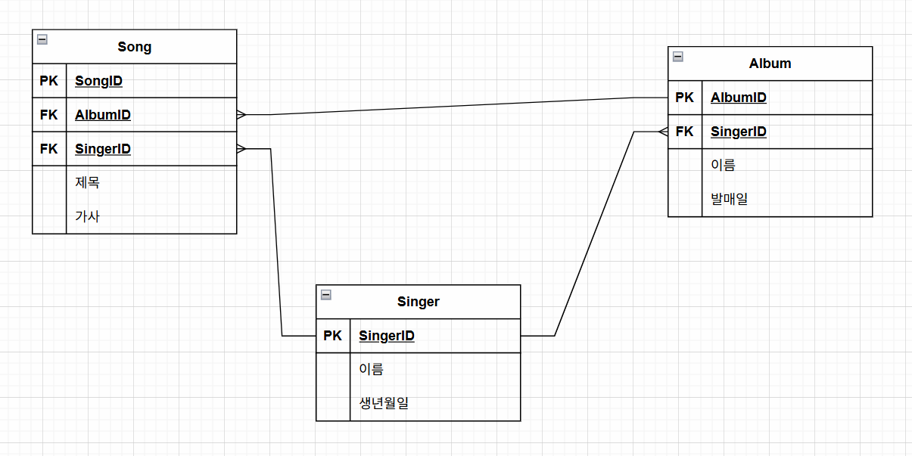

### 노래
- 제목
- 장르 - 1:N 으로 생각 / M:N 으로 생각
	- 하나의 노래가 여러개의 장르를 가질 수 잇느냐?
- 발매일
- 재생시간
- 작곡가
- 작사가
- 음반
- 가사

### 가수
- 이름
- 소속사
- 생년월일
- 키몸무게
- 데뷔일
- mbti
- 혈액형
- 국적
- 성별
- 어떤 그룹에 속해있는지

### 앨범(음반)
- 이름
- title - 타이틀곡
- 발매일
- 발매회사
- 가격
- 프로듀서
- 장르

## 나의 기획(simple)
- 노래 - 앨범
	- 하나의 노래는 하나의 앨범에만 실린다.
	- 하나의 앨범에는 여러 노래가 실린다.
- 노래 - 가수
	- 하나의 노래는 한명의 가수만 부른다.
	- 한명의 가수는 여러 노래를 부른다.
- 가수 - 앨범
	- 한명의 가수는 여러 개의 앨범을 가진다.
	- 한개의 앨범은 한개의 가수가 보유한다.

